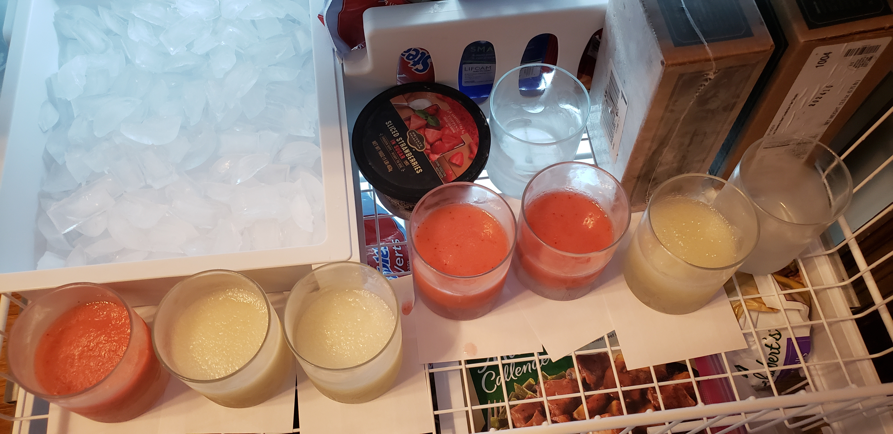
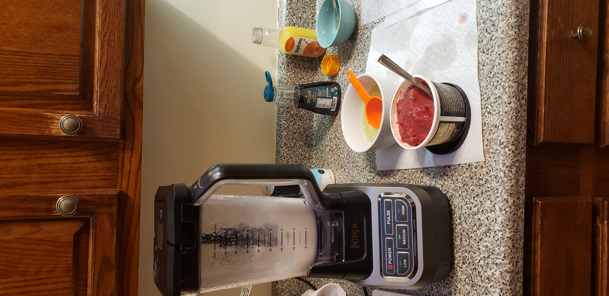
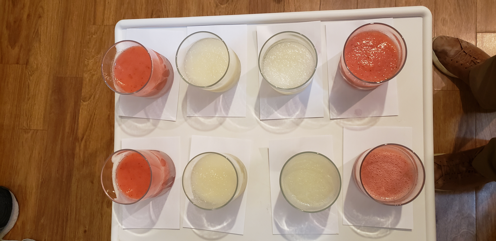

```{r setup, echo=F, eval=T, message=F, warning=F}
knitr::opts_chunk$set(echo = FALSE)
knitr::opts_chunk$set(eval = TRUE)
knitr::opts_chunk$set(fig.height = 3.5)

fs <- 9 # font size for titles in ggplot

library(tidyverse) # for data wrangling
library(kableExtra) # for table outputs
library(wiscR) # some plotting functions
library(gridExtra)
library(latex2exp)
```


```{r add-effect}
add_effect <- function(X, effect) {
  # X is a matrix (likely made by `generate_initial_design`)
  # effect is an effect represented by string of letters (e.g. "AB" or "ADE")
  # OR effect is a an integer
  factors <- colnames(X)
  
  if (typeof(effect) == "double"){
    
    
    combos <- t(combn(factors, 2))
    all_effects <- apply(combos, 1, paste0, collapse = "")
  } else {
    all_effects <- effect
  }
  
  for (string in all_effects){
    v <- strsplit(string, split = "")[[1]]
    X <- cbind(X, apply(X[, v], 1, prod))
    colnames(X)[ncol(X)] <- string
  }
  return(X)
}
```


```{r get-confounded}
get_confounded <- function(I){
  # I is identifying relation (I = "ABCD")
  # Returns all confounded variables as data.frame
  
  I.split <- (strsplit(I, ""))[[1]]
  
  # total number of combinations is 2^n. 
  # Subtract one since don't care about n choose 0
  # Subtract another 1 since don't need n choose n
  N <- 2^(length(I.split)) - 2
  df <- data.frame(lower.confounded = rep("", N),
                   higher.confounded = rep("", N),
                   stringsAsFactors = F)
  
  ix <- 1
  for (i in 1:(length(I.split)-1)) {
    combos <- apply(t(combn(I.split, i)), 1, paste0, collapse = "")
    for (string in combos) {
      tmp <- c(string, multiply_effects(c(I, string)))
      df[ix, ] <-  tmp[order(nchar(tmp), tmp)]

      ix <- ix + 1
    }
  }
  return(distinct(df))
}
```


```{r get-all-confounded}
get_all_confounded <- function(multiple_Is){
  N <- length(multiple_Is)
  con.df <- get_confounded(multiple_Is[1])
  
  for (i in 1:N){
    combos <- t(combn(multiple_Is, i))
    for (j in 1:nrow(combos)){
      vec <- ifelse(i %in% c(1,N), combos[j, ], multiply_effects(combos[j, ]))
      tmp.df <- get_confounded(vec)
      
      con.df <- rbind(con.df, tmp.df)
    }
  }
  return(con.df %>% distinct())
}

```


```{r Lenths-method, echo=F}
Lenths_method <- function(effects, alpha) {
  #effects: A vector or (preferably) a named list
  #alpha: level of test
  
  abs_effects <-  abs(effects)
  g <- length(abs_effects)
  
  s0 <- 1.5 * median(abs_effects)
  PSE <- 1.5 * median(abs_effects[abs_effects < 2.5 * s0])
  
  nu <- g / 3
  gamma <- 0.5 * (1 - (1 - alpha)^(1/g))
  
  critical <- qt(p = gamma, df = nu, lower.tail = F) * PSE
  ix <- abs_effects > critical
  
  return(list(sig.effects=effects[ix], critical=critical) )
}

# Dataset from slide 178 as gutcheck
# demo <- c(A=23, B=-5, C=1.5, AB=1.5, AC=10, BC=0, ABC=0.5)
# Lenths_method(demo, 0.1)

```


```{r Dongs-method, echo=F}
Dongs_method <- function(effects, alpha) {
    g <- length(effects)
    s <- 1.5 * median(abs(effects))
    
    for (i in 1:2){
      ix <- abs(effects) <= 2.5*s
      m <- sum(ix)
      
      s_sq <- sum(effects[ix]^2) / m
      s <- sqrt(s_sq)
    }
    
    gamma = 0.5 * (1 - (1 - alpha)^(1/g))
    critical <- qt(p=gamma, df=m, lower.tail = F) * s
    sig.ix <- abs(effects) > critical
    return(list(sig.effects=effects[sig.ix], critical=critical) )
}

# demo <- c(A=23, B=-5, C=1.5, AB=1.5, AC=10, BC=0, ABC=0.5)
# Dongs_method(demo, 0.1)

```

```{r find-lambda}

transform_BoxCox <- function(y, lambda) {
  # y is response vector
  # lambda is a Box-Cox parameter
  # Following chunk borrows heavily from Prof. Loh's code
  gm <- exp(mean(log(y)))
  if (lambda == 0){
    y.out <- gm*log(y)
  } else {
    y.out <- (y^lambda - 1) / (lambda * gm^(lambda-1))  
  }
  return(y.out)
}


get_best_lambda <- function(df, lower, upper){
  # df must have a capital Y response column
  # lower and upper are search space for lambda
  
  lambda.range <- seq(from=lower,to=upper,length.out=50)
  df.copy <- df
  y0 <- pull(df, Y)
  
  SSR <- NULL
  
  for (lambda in lambda.range){
    df.copy$Y <- transform_BoxCox(y0, lambda)
    
    fit <- lm(Y ~ ., df.copy)
    SSR <- c(SSR, sum(fit$resid %*% fit$resid))
  }
  # Lambda that minimized sum of square residuals
  lambda.optimal <- round(lambda.range[which(SSR==min(SSR))], 2)
  # Return a data frame with transformed Y vector
  df.transformed <- df %>% mutate(Y = transform_BoxCox(Y, lambda.optimal))
  
  return(list(lambda.range=lambda.range, SSR=SSR, lambda.optimal=lambda.optimal, 
              df.transformed=df.transformed))
}

```


```{r generate-initial-design}
generate_initial_design <- function(p){
  # Creates an X matrix with p columns. Each column is composed of 1s and -1s.
  # The patterns of + and - are different in each column. For example:
  # Col 1: + - + - + -...
  # Col 2: + + - - + +...
  # p is the number of factors and is only required (accepted) input.
  
  runs <- 2^p
  X <- matrix(rep(0, runs*p), nrow = runs)
  colnames(X) <- LETTERS[seq( from = 1, to = p )] # assign column names from alphabet
  
  for (jj in 1:p){
    pattern_multiplier <- 2^(jj - 1)
    string_multiplier <- 2^(p-jj)
    
    ix <- c(rep(1, pattern_multiplier), rep(-1, pattern_multiplier))
    X[,jj] <- rep(ix, string_multiplier)
  }  
  
  return(X)
}
```

```{r multiply-effects}
multiply_effects <- function(str_vec) {
  # helper function, multiply letter strings
  # E.g. multiply_effects("ABC", "CDE") --> "ABDE"
  N <- length(str_vec)
  while (N > 2) {
    str_vec <- c(multiply_effects(str_vec[1:2]), str_vec[3:N])
    N <- length(str_vec)
  } 
  counts <- table(strsplit(paste0(str_vec[1],str_vec[2]), ""))
  # If the number of occurrences is odd, that letter stays (was not canceled)
  reduced <- paste0(names(counts[counts %% 2 == 1]), collapse="")
  return(reduced)
  
}
```


# Summary

An unreplicated $2^{7-2}_{IV}$ quarter-fractional experiment was conducted to model the contribution of seven variables on the quality scores of frozen margaritas. Subsequent analysis found three main-effects to be significant under three hypothesis testing methods: assuming higher order interactions are negligible, Lenth's method, and Dong's method. One two-factor interaction was also found significant by all three of the methods. 

\newpage

# Introduction

## Background

A margarita in its simplest form is a cocktail comprised of tequila, triple sec, and lime juice. Its frozen cousin is made by blending all of these ingredients with ice. More complex recipes call for additional fruits--strawberries, pomegranates, or peaches. They can also call for small quantities of raw agave syrup (from which tequila is distilled), orange juice, or freshly-squeezed lime juice. We want to learn which factors contribute to an overall better (conversely worse) taste.

## Factors

We consider seven factors that comprise a frozen margarita. Three of these factors--tequila brand, tequila color, and triple sec brand--are "substitution" variables. We use either type A or type B for this variable. The other five variables--frozen strawberries, orange juice, lime juice, and agave--are "inclusion" variables. These are either included or excluded for a given run. The seven variables are discussed thoroughly below.

***Tequila Brand*** We consider two tequila manufacturers that are representative examples for medium-priced and higher-priced tequilas. Does more expensive tequila contribute to a higher taste score? The first company Altos is a middle-priced tequila that is commonly used in mixed drinks. In Table 1 we call it "cheap" but that is just in relation to the second brand we consider. The second brand in our experiment is Casmaigos, founded in 2013 by George Clooney and two of his friends. After just four years, the actor [sold the company](https://www.businessinsider.com/george-clooney-tequila-brand-casamigos-started-by-accident-2017-6) for one billion US dollars. This tequila is commonly served on its own and is known for its complex flavors.

***Tequila Color:*** Tequila is distilled from agave, a palm-like shrub that grows in Mexico. Like whiskey, the differentiation of tequila comes from the aging process. There are three types of tequila: blanco (white), reposado (rested), and anejo (vintage). Because blanco is not aged, it has strong flavors that go well in mixed drinks. Reposado is aged in oak barrels for two to 12 months. This aging cuts some of the sharpness and gives the tequila a subtler flavor. Anejo is aged even longer and is generally consumed on its own. For this reason, we only consider blanco and reposado tequilas. This factor is called tequila color because blanco tequila is clear and reposado is light brown.

***Triple Sec:*** Triple sec is a sweet orange-flavored liqueur that is used in margaritas, long island iced teas, and cosmopolitans. The gold-standard triple sec is made by a company called Cointreau. Cointreau is relatively expensive, so we are interested in seeing if Cointreau produces a different taste score than that of a cheaper triple sec (in our experiment we use De Kupyer).

***Frozen Strawberries:*** Frozen strawberries are included in many recipes. Margaritas with strawberries are sweeter and fruitier. We consider two levels: margaritas with and without frozen strawberries.

***Orange Juice:*** Orange juice (without pulp) is a natural compliment to the lime flavoring of margaritas, and the orange flavoring of triple sec. Does the addition of orange juice change the flavor score? The presence or absence of orange juice is another factor.

***Lime Juice:*** In addition to lime concentrate, recipes occasionally call for a small quantity of freshly-squeezed lime juice to bring out the citrus flavors. Our experiment includes drinks with and without added lime juice.

***Agave:*** Agave syrup comes is a sugary substance produced by agave plants. It is used to distill tequila. Many margarita recipes call for agave syrup to add sweetness to the tart base of lime juice or lime concentrate. Some even use it as a sugar substitute in coffee or tea. The final factor is whether or not to add agave to the margarita.


The seven factors and their two levels are found in the following table. For ease of notation, the first seven capital letters of the Roman alphabet are used as abbreviations. The first five variables--$A$ through $D$--are the so-called starting variables and are in standard order. $F$ and $G$ are generated using Box, Hunter, and Hunter's generators for a a $2^{7-2}_{IV}$ design, discussed more thoroughly in the following section.

\begin{table}[]
\centering
\caption{Factor levels of seven experimental variables.}
\begin{tabular}{c|c|c|c}
\hline
Factor & Level I & Level II & Abbreviation \\
\hline
Base Flavor & Lime & Strawberry & A \\
Orange Juice & None & 1 oz & B \\
Lime Juice & None & 1.5 oz & C \\
Agave Nectar & None & 2 tbsp & D \\
Triple Sec Brand & De Kuyper (Cheap) & Cointreau (Expensive) & E \\
Tequila Brand & Altos (Cheap) & Casamigos (Expensive) & F \\
Tequila Color & Blanco & Reposado & G \\
\hline
\end{tabular}
\end{table}


# Experimental Design

The following sections cover the design of the experiment: 

## Quarter-fractional Design Matrix

Our budget is 32 runs, which will be collected in four blocks of eight. Blocking is discussed more in the following subsection. With seven variables and 32 runs budgeted, we use a $2^{7-2}_{IV}$ design. The quarter-fractional design is an "aggressive" experiment; we will be able to estimate main effects as well as some second-order interaction effects assuming third-order and higher effects are negligible. We use the generators from [Box, Hunter, and Hunter](#references) $F=ABCD$ and $G=ABDE$. Then our identifying relation is $I = ABCDF = ABDEG = CEFG$. The resolution four alias, $CEFG$, gives us the six confounded two-factor interactions: $CE$ and $FG$; $CF$ and $EG$; $CG$ and $EF$. These six two-factor interactions in plain English, are any two of Lime Juice, Triple Sec, Tequila Brand, Tequila Color. Now there are ${7 \choose 2} - 6 = 21 - 6 = 15$ estimable two-factor interactions. 

The proposed experiment is unreplicated, which naturally involves tradeoffs. On the one hand, the unreplicated design with a pre-determined budget allows us to include seven variables with only 32 runs. These seven factors cover nearly all of the common ingredients in frozen margaritas. On the other hand, we lose the ability to estimate the variance of the model residuals. This makes significance testing a bit trickier, but we have tools to make good inferences.

## Blocking

Thirty-two runs are spread over four blocks, where each block is run on a different day. Blocking is necessary for two reasons. First and foremost, we have just one taster who could not do an adequate job judging 32 different margaritas. Anything past, say, the 15th drink would get a ten out of ten. Second, equipment limits make batches of eight. The two blocking variables are generated from $CE$ and $CF$ since these are already confounded by the quarter-fractional design. Of course this implicitly confounds $CE*CF = EF$, but this two-factor interaction was also confounded by the fractional design. Therefore, we do not lose any more of the two-factor interactions besides the six already lost. The runs and blocks are summarized in the table below. Crucially, the order of the blocks is randomized as well as the runs within each block.

```{r create-design}
# 2^(7-2) means 5 variables in standard order + 2 "generated" using 
# Box, Hunter, Hunter
X <- generate_initial_design(5)

generator1 <- "ABCD" # = F -> I = ABCDF
generator2 <- "ABDE" # = G -> I = ABDEG

X <- add_effect(X, generator1)
X <- add_effect(X, generator2)

colnames(X)[6:7] <- c("F", "G")

block1 <- "CE"
block2 <- "CF"

X <- add_effect(X, block1)
X <- add_effect(X, block2)

colnames(X)[8:9] <- c("BlockX", "BlockY")

# Change block variables from BlockX BlockY to 4 named blocks
df.design <- X %>%
  as.data.frame(row.names = F) %>%
  mutate(tmp = paste0(BlockX, BlockY)) %>%
  mutate(Block=recode_factor(tmp, `-1-1`="B1", `-11`="B2", `1-1`="B3", `11`="B4")) %>%
  select(-c(BlockX, BlockY, tmp)) %>%
  mutate(Run = 1:32) %>%
  relocate(Run)

# Print table 
t1 <- df.design[1:16, ]
t2 <- df.design[17:32,]
knitr::kable(list(t1, t2), booktabs = T, valign = 't',row.names = F,
             caption = '32 Runs in standard order with blocks.') %>%
  kable_classic() 
```
```{r randomize-runs}
set.seed(919)
block.order <- sample(unique(df.design$Block))

R <- matrix(nrow = 4, ncol = 8)
for (b in 1:4){
  R[b,] <- df.design %>%
    filter(Block == block.order[b]) %>%
    pull(Run) %>%
    sample() 
}

row.names(R) <- block.order
colnames(R) <- 1:8

R %>%
  kable(valign = 'c', caption = 'Blocks and runs randomized', booktabs=T) %>%
  kable_classic()  %>%
  kable_styling(bootstrap_options = "striped")
```


## Protocol

The following protocol is used to create eight runs in one block. The recipe is found in table 3. Measurements for a full pitcher and a single glass are presented. Our experiment used the "Drink" column so as to not waste raw ingredients. The full pitcher recipe is provided in case the reader would like to enjoy 


\begin{table}[]
\centering
\caption{Recipe used for all runs.}
\begin{tabular}{c|c|c|c|c}
\hline
& \multicolumn{2}{c}{Pitcher} & \multicolumn{2}{c}{Drink (1/6 pitcher)} \\
& Ounces & Cups/shots & Ounces & Cups/shots \\
\hline
Frozen Limeade & 12 oz & 1.5 cups & 2 oz & 1/4 cup \\
Frozen Strawberries & 12 oz & 1.5 cups & 2 oz & 1/4 cup \\
Tequila & 9 oz & 6 shots & 1.5 oz & 1 shot \\
Triple Sec & 4.5 oz & 3 shots & 3/4 oz & 1/2 shot \\
Ice Cubes & 48 oz & 6 cups & 16 oz & 1 cup \\
Lime juice & 1.5 oz & 1 shot & 1/4 oz & 1/2 tbsp \\
Orange Juice & 1 oz & 2 tbsp & 1/6 oz & 1 tspn \\
Agave Nectar & 1 oz & 2 tbsp & 1/6 oz & 1 tspn \\
\hline
\end{tabular}
\end{table}

***Equipment***

A standard set of measuring cups is used to measure each ingredient. A Ninja Pro 1100 watt blender is used for all runs. Eight identical high-ball glasses are used to serve drinks.

***Preparation***

All tequila and triple sec is placed in the refrigerator 24 hours before the drinks are made. All high-ball glasses are placed in the freezer one hour prior to the start of the experiment. Because of the time it takes 

***Creating the mixture***

The following ingredients (in order) are added to the blender.
1. Limeade concentrate (and frozen strawberries if called for in run)
2. Tequila
3. Triple sec
4. Orange juice (if called for)
5. Lime juice (if called for)
6. Agave nectar (if called for)
7. Salt
8. 12 ice cubes

Blend for two minutes on medium setting. Pour mixture into highball glass and place back in the freezer. Wash out pitcher and dry with towel. Repeat the aforementioned steps for the seven additional runs. 

***Data Collection***

The eight identical glasses are presented in the (random) order in which they were made. Drinks are placed on top of blank note cards along with a glass of water (palette cleanser) and pen to write scores. One taster is used for all blocks. The taster is allowed twenty minutes to sample all eight drinks. The taster is allowed to try drinks as many times as needed. The taster scores each drink from one to ten with one being "bad" and ten being "good". The taster sampling all drinks at once removes bias in scores because it allows the taster to calibrate their scores. For example, if drinks were presented one at a time, the taster may initially think that the first drink is an "eight", but then think the second drink is much better. The taster may realize that the first drink *should* have been scored as a five. Presenting all eight drinks simultaneously remedies this issue. However, scores of the drinks will not be independent. We will discuss this in depth in the model diagnostics section.

# Analysis of Data

## Full Model

We start by fitting a model with a global mean, all seven main effects, three blocking variables (four blocks can be coded as three variables), and 15 two-factor interactions. These 15 two-factor interactions, as discussed previously, are not confounded with any other two-factor interactions. In the usual notation, with $\eta$ being the global mean, $A/2$ is half of the $A$ main effect,..., $\epsilon \sim \mathcal{N}(0, \sigma^2)$ where $\sigma^2$ is unknown. Let $x_1$ be $1$ if $A$ is in its high level and $-1$ if $A$ is in its low level. Define $x_2, ..., x_7$ similarly for the $B, ..., G$ factors. The $Block_k$ variable with $k \in \{1,2,3 \}$ is $1$ if the corresponding run is in block $k$ and zero otherwise (i.e. runs in block 4 have zeros for each of the three blocking variables). 

Then the model can be expressed as follows.
$$\mathbb{E}[Y] = \eta + \frac{A}{2}x_1 + \frac{B}{2}x_2 + \frac{C}{2}x_3+ \frac{D}{2}x_4+ \frac{E}{2}x_5+ \frac{F}{2}x_6+ \frac{G}{2}x_7$$
$$\quad + \frac{AB}{2}x_1x_2 + \frac{AC}{2}x_1x_3 + \frac{AD}{2}x_2x_4+ \frac{AE}{2}x_1x_5 + \frac{AF}{2}x_1x_6 +\frac{AG}{2}x_1x_7 + \frac{BC}{2}x_2x_3$$
$$\quad  + \frac{BD}{2}x_2x_4+ \frac{BE}{2}x_2x_5 + \frac{BF}{2}x_2x_6 + \frac{BG}{2}x_2x_7 + \frac{CD}{2}x_3x_4 + \frac{DE}{2}x_4x_5+ \frac{DF}{2}x_4x_5 + \frac{DG}{2}x_4x_7$$
$$\quad + Block_1 + Block_2 + Block_3 + \epsilon$$

```{r full-model-anova, message=F, warning=F}
tmp <- read.csv("../data/data.csv", row.names = 1)
colnames(tmp)[1:7] <- LETTERS[1:7]

df <- merge(x = tmp, y = df.design, by = LETTERS[1:7], all = TRUE, sort = FALSE)
contrasts(df$Block) <- matrix(c(1,0,0, 0,1,0, 0,0,1, 0,0,0), nrow = 4, byrow = T)
estimable_effects <- c("AB", "AC", "AD", "AE", "AF", "AG", 
                       "BC", "BD", "BE", "BF", "BG",
                       "CD", "DE", "DF", "DG") # 15 estimable 2fi

for (ff in estimable_effects){
  df <- add_effect(df, ff)
}

v <- c(LETTERS[1:7], estimable_effects, "Block", "Y")
df <- df %>%  select(v)

model.full <- lm(Y ~ . , data = df)
effects <- model.full$coefficients[-1]*2

tmp <- data.frame(Effect = c(names(effects), "Grand Mean"),
           Estimate = c(round(unname(effects),2), model.full$coefficients[1]))

t1 <- tmp[1:7, ]
t2 <- tmp[8:14,]
t3 <- tmp[15:21, ]
t4 <- tmp[22:26, ]

knitr::kable(list(t1,t2,t3,t4), booktabs = T, valign = 't',row.names = F,
             caption = 'Estimated main and non-confounded two-factor interactions.') %>%
  kable_classic() 

lenth <- Lenths_method(effects, 0.10)
dong <- Dongs_method(effects, 0.10)
```


Estimates of the main and non-confounded two-factor interactions are in Table 5. Three things stand out to me. First, the magnitude of the strawberry ($A$) main effect is larger than all the others, and nearly twice as large as the second biggest ($D$ aka agave syrup) effect. Second, the block variables are close to zero. This is good news because it means that the block effects are, at the very least, not detrimental to the experiment. Finally, the estimate of the $F$ main effect--tequila brand--is zero. If this is 

We cannot estimate $\sigma^2$ because our experiment is unreplicated. This prevents us from using traditional t-tests for the null hypothesis that an effect is zero. Lenth $\theta_1 = A, \theta_2 = B, ..., \theta_{22}=DG$. The null hypotheses are $H_{0}^1:\theta_1 = 0; ...; H^{22}_{0}: \theta_{22} = 0$. The alternative hypotheses are $H_{0}^1:\theta_1 \neq 0; ...; H^{22}_{0}: \theta_{22} \neq 0$. Set the size of the test to $\alpha = 0.1$.

***Note on Using Higher-Order Interactions to Estimate $\sigma^2$***

Seven of the 31 total degrees of freedom are allocated to estimate main effects. Another 15 are used to estimate two-factor interactions. Three more are used on estimating block effects. If we assume three-factor and higher interactions are negligible, then we have six degrees of freedom left to "estimate" $\sigma^2$. However, as discussed in Mead's book, some of the error degrees of freedom correspond to confounded two-factor interactions and so are not even reliable for estimating error variance (page 347). This limitation was known when the experiment was designed and can be overcome using Lenth's and Dong's methods for testing for significant effects.

***Lenth's Method***

Lenth's method defines the following: 
$$s_0 = 1.5 \times \text{median}|\hat{\theta}_i |$$
$$PSE = 1.5 \times \text{median} \{|\hat{\theta}_i| : |\hat{\theta}_i| < 2.5s_0 \}$$
$$\nu = g/3 \text{ and } \gamma = 0.5(1 - (1-\alpha)^{1/g})$$

The critical value for the test that rejects the null at level $\alpha=0.1$ is $t_{\nu, \gamma} \times PSE$. Calculation


Critical value $c_{Lenth's} = 1.46$

***Dong's Method***

Dong's method is a less conservative improvement to Lenth's method. It gives a critical value of 1.54, which classifies $A,D,G, \text{ and } AE$ as significant as well. The functional code can be found in the appendix. Briefly, the method uses the same notation for 

***Summary of Significant Factors and interpretation***

Check for errors fluctuating over run order? Or total score

```{r}
order.df <- df$Y[R] %>% matrix(nrow=4, byrow = F) %>% t() %>% as.data.frame()
colnames(order.df) <- paste0("Block", c(4,2,3,1))
order.df$Order <- 1:8

p1 <- order.df %>%
  pivot_longer(cols = -Order, values_to = "Response", names_to = "Block") %>%
  ggplot(aes(x = Order, y = Response, color = Block)) +
  geom_point() +
  theme_minimal() +
  xlab("Run order within block") +
  geom_jitter(width = 0.1, height=0) +
  theme(legend.title = element_blank(),
        legend.text = element_text(size = 10),
        legend.position = "top",
        legend.background = element_rect(fill = "white", color="white")) +
  guides(color=guide_legend(ncol = 4,nrow=1, byrow = F))

```


```{r significant-effects-plot, fig.cap="(Left) Run order does not effect the response. (Right) A, D, G, and AE effects are significant by both methods."}
effects.df <- data.frame(Effect = names(effects),
                         Estimate = effects)

effects.df$Effect <- factor(effects.df$Effect, levels = effects.df$Effect[order(abs(effects.df$Estimate), decreasing = T)])


p2 <- effects.df %>%
  ggplot(aes(y = Effect, x = abs(Estimate))) +
  geom_col() +
  geom_vline(aes(xintercept = lenth$critical,  color = "Lenth's Threshold")) +
  geom_vline(aes(xintercept = dong$critical,  color = "Dong's Threshold")) +
  theme_minimal() +
  xlab(TeX("$| \\hat{\\theta} |$")) +
  ylab("") +
  guides(fill=guide_legend(ncol=2)) +
  theme(legend.position = "top",
        legend.background = element_rect(fill = "white", color = "white"),
        legend.title = element_blank())

grid.arrange(grobs=list(p1,p2), ncol=2)

```


## Restricted Model

We now consider a restricted model

$$\mathbb{E}[Y] = \eta + \frac{A}{2} x_1 + \frac{D}{2} x_4  + \frac{G}{2} x_7  + \frac{AE}{2} x_1 x_5 + \epsilon $$

Because the contrasts are orthogonal, we can simply pluck the estimates of the regression coefficients from table 3 and divide by two to get the estimated regression coefficients. Means are different.
$$\mathbb{E}[Y] = 5.4375 + 1.75 x_1 - x_4  - 0.9375 x_7  + 0.875 x_1 x_5 + \epsilon $$

### Restircted Model Diagnostics

There are three fundamental assumptions made in our linear regression model. First, 

Slight departure from normality as seen in the QQ normal plot in figure 3.


```{r model-reduced, fig.cap="(L) Residuals from reduced model do not depart from normal distribution. (R) There is not strong evidence for residual dependence."}
model.reduced <- lm(Y ~ A + D + G + A:E, data = df)

p1 <- qqplot(model.reduced$residuals) +
  xlab("Theoretical") +
  ylab("Residual") +
  theme_minimal()

p2 <- data.frame(fitted = model.reduced$fitted.values, residual= model.reduced$residuals) %>%
  ggplot(aes(x=fitted, y=residual)) +
  geom_point() +
  theme_minimal() +
  xlab("Fitted") +
  ylab("Residual") 

grid.arrange(grobs=list(p1,p2), ncol=2)
```
In dollars and cents terms, this indicates that "expensive" triple sec and "expensive" tequila do not have significantly different taste scores compared to their cheaper


## Box-Cox Transformation

Initial model diagnostics do not suggest large departures from linear model assumptions. We do not have any cause for concern. However, we may be able to improve upon our restricted model by transforming the taste scores. In particular, assume that $\exists \lambda$ such that 

$$\begin{array}{l}
      0\\
      1
\end{array}$$


Iterating over a range of potential $\lambda$ values, we find the maximum likelihood estimate for $\lambda \approx 0.75$. 
```{r box-cox}
# Subset a data frame for box-cox
df.input <- df %>% select(c(A,B, C, D,E,F,G,Block, Y))

output <- get_best_lambda(df.input, 0, 1.5)


# Data wrangling for plotting
tmp <- data.frame(lambda = output$lambda.range, SSR = output$SSR)
p1 <- tmp %>%
  ggplot(aes(x = lambda, y = SSR)) +
  geom_point() +
  geom_line() +
  theme_minimal() +
  xlab(expression(lambda)) +
  ylab("SSR") +
  geom_vline(xintercept = output$lambda.optimal, color = "blue") +
  ggtitle(TeX("Finding best $\\lambda$"))


df.bc <- df.input %>%
  mutate(Y = transform_BoxCox(.$Y, 0.75))
model.BC <- lm(Y ~ ., data = df.bc)
# anova(model.BC)

# [-1] drops the intercept
effects.BC <- 2*model.BC$coefficients[-1]
lenth.BC <- Lenths_method(effects.BC, 0.1)
dong.BC <- Dongs_method(effects.BC, 0.1)
```


```{r, box-cox-plots, fig.height=4, fig.subcap=c("(A) some plot", "(B) Some other plot", "aaaaaaaaa")}

p2 <- data.frame(fitted = model.BC$fitted.values, residual=model.BC$residuals) %>%
  ggplot(aes(x=fitted, y=residual)) +
  geom_point() +
  theme_minimal() +
  xlab("Fitted response") +
  ylab("Residual") +
  ggtitle("Residuals vs fitted \n after Box-Cox")

p3 <- wiscR::qqplot(model.BC$residuals) + theme_minimal() +
  xlab("Theoretical quantile") +
  ylab("Sample quantile") +
  ggtitle("QQ Normal of residuals after Box-Cox") +
  theme(plot.title = element_text(size = fs))

effects.BC.df <- data.frame(Effect = names(effects.BC),
                            Estimate = effects.BC)
effects.BC.df$Effect <- factor(effects.BC.df$Effect, levels = effects.BC.df$Effect[
  order(abs(effects.BC.df$Estimate), decreasing = T)])

p4 <- effects.BC.df %>%
  ggplot(aes(y = Effect, x = abs(Estimate))) +
  geom_col() +
  geom_vline(aes(xintercept = lenth.BC$critical,  color = "Lenth's Threshold")) +
  geom_vline(aes(xintercept = dong.BC$critical,  color = "Dong's Threshold")) +
  theme_minimal() +
  xlab(TeX("$| \\hat{\\theta} |$")) +
  ylab("") +
  theme(legend.position = c(0.8, 0.75),
        legend.text = element_text(size = 9),
        legend.background = element_rect(fill = "white", color = "white"),
        legend.title = element_blank()) +
  ggtitle("Significant effects \n after Box-Cox")

grid.arrange(grobs=list(p1,p2,p3, p4), ncol = 2)

```

Residuals are not notably more normal. We did not identify any new main effects. Conversely we did not rule any significant effects from the restricted model to be insignificant after performing the Box-Cox transformation. Finally, the $Y^{\frac{3}{4}}$ transformation is less interpretable than the raw response. For these reasons, the restricted model with three main effects and one two-factor interaction is better.

# Final Model


# Follow-up Study: Unreplicated 2^3 Experiment to Examine Two-Factor interactions.

After conducting 32 runs and analyzing the data we have enough tequila to make two more drinks for each color-brand combination: two Casamigos Blanco, two Altos Blanco, two Casamigos Reposado, and two Altos Reposado. There is enough of each triple sec to make at least four drinks. The other ingredients are relatively cheap and can be replenished. In short, our limiting factor is tequila. 

***Why not replicate?***

There are two reasons why I do not want to replicate the experiment. Most obviously, it would require doubling the financial and (experimental) costs. Second, replication does not get us anything I need or want. Replication would only allow us to get an estimate of $\sigma^2$. It would allow us to build more robust simultaneous confidence intervals (e.g. Bonferroni or Shceffe). This is not needed. I feel confident in the classification of three main effects and one two-factor interaction being significant. There were effects that were "on the fence." That is to say, no variables were *almost* significant. Because of this, I am not too concerned with estimating $\sigma^2$ and getting more robust confidence intervals.

***Why not the other half-fraction?***

An additional 32 runs, as in the last paragraph, would require doubling the budget. Additionally, it would not get us much additional information for the time and money.

***Why not adding a one-eight fraction?***

Mead and Gilmour discuss a "partial" folding over in ... This would get us ???


***An Unreplicated $2^3$ Follow-up to estimate two-factor interactions***

 By using a fractional design, we confounded six total two factor interactions, including a few of interest: $FG = `TequilaBrand:TequilaColor`$; $EF = `TripleSecBrand:TequilaBrand`$; and $EG=`TripleSecBrand:TequilaColor`$.


Before conducting the experiment, I assume the three factor interaction $EFG$ is negligible.


```{r follow-up-prep}
X2 <- generate_initial_design(3) %>% as.data.frame()
row.names(X2) <- 1:8
colnames(X2) <- c("E", "F", "G")

set.seed(919)
ix <- sample(1:8)
X2 <- X2[ix, ]

write.csv(X2, "../design-matrices/design-followup.csv")
```


```{r follow-up}
df.2 <- read.csv("../data/data-followup.csv", row.names = 1)

mod.2 <- lm(Y ~.^3, data=df.2)

eff.2 <- 2 * mod.2$coefficients[-1]
Lenths_method(eff.2, 0.1)
Dongs_method(eff.2, 0.1)
```

The model is 
$$\mathbb{E}[Y^*] = \eta^* + \frac{E}{2} + \frac{F}{2} + \frac{G}{2} + \frac{EF}{2} + \frac{EG}{2} + \frac{FG}{2} + \frac{EFG}{2} + \epsilon.$$
We assume the three-factor interaction is zero in order to estimate $\sigma^2$. Of course, this estimate will be poor because it is calculated using only one degree of freedom.


The $EFG$ estimate is $1.5.$ Then $SD(\text{effect}) = \sqrt{\text{Var(effect)}} = \sqrt{(EFG)^2} = 0.75$.

```{r}
bon.p <- 0.1 / 6
t <- qt(bon.p, df = 1, lower.tail = F)
sd <- (mod.2$coefficients[8]*2) %>% unname()

half.interval <- t*sd
```

We continue to use $\alpha=0.1$. Then a Bonferroni-adjusted p-value is $0.1 / 6$ and the critical $t$-statistic is found using `qt()`. $t_{1, 0.1/6} \approx 19$. Then the confidence intervals take the form $\text{Estimate} +/- 19*1.5$. Clearly an interval this wide does not return any significant effects. Of course, because this method is inferior in many respects, we also try Lenth's and Dong's methods. These too find no significant effects. 

There is not strong statistical evidence that the $EF$, $FG$, or $EG$ two-factor interactions are significant in this follow-up study. 

Why I am not concerned that the $G$ effect is not significant here.

### Critical Values 

# Limitations

There are several ways to improve the design and execution of this experiment. 

***Tasters*** 

First, the use of multiple, randomly-selected tasters could have been used and a summary statistic (average or median) could have been used. This was considered early on, but was difficult to coordinate given the ongoing pandemic. 


***Replication:*** Replicating this experiment would allow us to estimate $\sigma^2$ which would help during model fitting and diagnostics.

***Batch Sizes*** When making "frozen" margaritas in single-serving batches, the drinks are more of a slushy consistency than a true frozen margarita. This would have wasted some 85% of the raw materials and would have increased the cost of the experiment six-fold.

# Conclusion

Three models were considered: an unrestricted model with seven main effects and 15 two-factor interactions; a reduced model with three main effects and one two-factor interaction; and a Box-Cox transformed model which had no significant effects. 

\newpage

\newpage

# Appendix

Supplemental information, including code, data, and recipes are found in the following sections.

## Code

### Helper functions

```{r helper-functions, ref.label=c("setup", "add-effect", "get-confounded", "get-all-confounded", "generate-initial-design", "multiply-effects"),echo=T, eval=T}

```

### Experimental design

```{r experimental-design, ref.label=c("create-design", "randomize-runs"), echo=T, eval=T}

```

### Analysis and plotting of "main" dataset

```{r hypothesis-testing, ref.label=c("Lenths-method", "Dongs-method"), echo=T, eval=T}

```

### Analysis and plotting of "follow-up" dataset


\newpage

# References

[1] Box, Hunter, and Hunter. \
[2] Wu and Hamada. Experiments: Planning, Analysis, and Parameter Design Optimization. 2nd Edition. \
[3] Mead, Gilmour, and Mead. Statistical Principles for the Design of Experiments: Applications to Real Experiments. \

\newpage

## Supplemental





